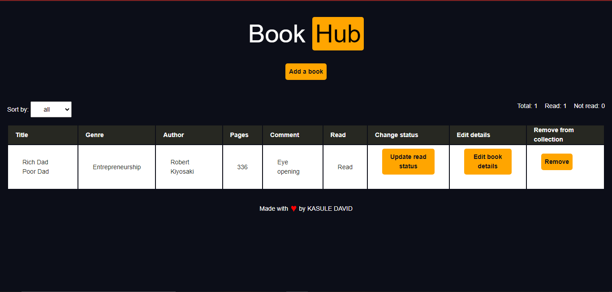
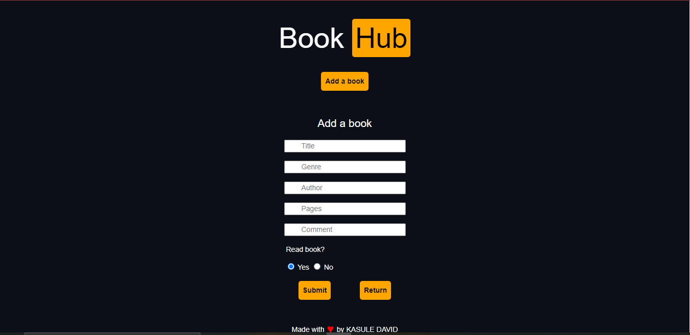

## **Installation**

> **Note** 
>> [A live deployment of `BookHub` is available on GitHub pages](https://kasd97.github.io/BookHub/)

For those that would like to run the application and/or edit its source code on their local computer, follow the steps below:

1. Clone the repository with `git clone https://github.com/KasD97/BookHub`.
2. Navigate to where the repository is saved on your local machine and open up its `index.html` file on your preferred web browser.

 

## **Usage**

- To add a book to your library, click on the "Add a book" button in order to open up a form.
- Fill up the entire form with input information related to the book.
- Check the preferred option under "Read book".
- Click submit to add the book and its details to your library.
- Update book details by clicking pn the "Edit book details" button of the book's row.
- Toggle the read status of the book by clicking on the "Update read status" button.
- Delete the book from the library by clicking on the "Remove" button on the book's row.
- Sort the books in the library in either ascending or descending order with the "Sort by" selection box.

 

## **Preview**

| Desktop - Main Screen preview |
| :-------------: |
|     |

| Desktop - Form preview |
| :-------------: |
|     |

 

## **Outcome**

* Saves user's books in **local storage** which helps to retrive after refresh

 

## **Built With**

-    
-    
- 

 

## **Tools Used**

-    
-  
-    

 

## **License**

- [MIT License](https://github.com/KasD97/BookHub/blob/main/LICENSE)
- Copyright **©** 2023 - [David Kasule](https://github.com/KasD97/)

 
